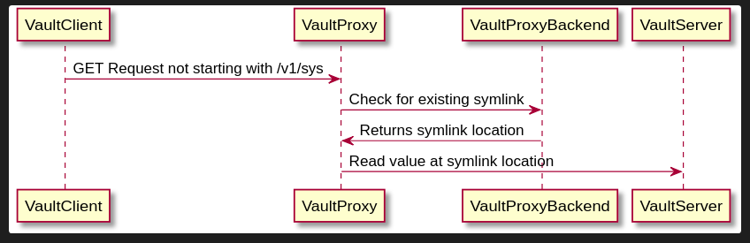
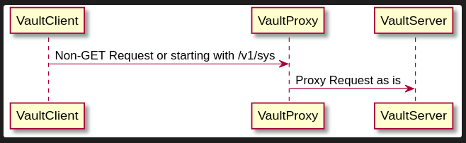

# Vault Symlink Proxy (VLN)

## Why?

The origin story of why Go-VLN came is be all started with [Concourse](https://github.com/concourse/concourse)!

Concourse forces you to put all your secrets under a given base path for concourse to be able to access them.
It also follow certain lookup rules described [HERE](https://concourse-ci.org/vault-credential-manager.html#vault-credential-lookup-rules)

Starting with this, we had two choices:

- Put all our secrets under `concourse/`
- Duplicate all our secrets under `concourse/`

Both options are not really clean. With Go-VLN we can now have secrets in their rightful place follow XYZ naming convention, then have concourse read symlinks under `concourse/`. Everyone is happy!

## Logic

Flow for reading secrets



Flow for all the other requests



## Vault Backend

Example policy for KV v2:
```hcl
path "secret/data/vln/symlinksDB" {
  capabilities = ["read"]
}

path "auth/approle/login" {
  capabilities = ["create"]
}
```

Example policy for KV v1:
```hcl
path "secret/vln/symlinksDB" {
  capabilities = ["read"]
}

path "auth/approle/login" {
  capabilities = ["create"]
}
```