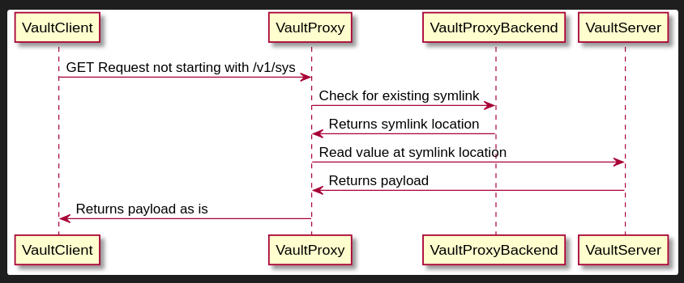

# Vault Symlink Proxy (VLN)

A fairly straightforward proxy that aliases secrets in Vault with reasonable
security compromises.

## The Why

The origin story of why Go-VLN came to be all started with
[Concourse][concourse]!

[concourse]: https://github.com/concourse/concourse

Concourse forces you to put all your secrets under a given base path so it can
abstract several different secret management engines. It also follow certain
lookup rules described [in the Concourse documentation][cred_lookup]. This is
great for Concourse, great for interoperability, but mildly inconvenient for
cleanliness.

[cred_lookup]: https://concourse-ci.org/vault-credential-manager.html#vault-credential-lookup-rules

Facing this we had two choices:

- Put all our secrets under one path: `concourse/`
- Duplicate all the secrets that Concourse requires under `concourse/`

Both options are not really clean, and scale poorly when a lot of people need to
lifecycle those secrets. With Go-VLN we can now have secrets in their rightful
place follow whichever naming convention is sensible in your organization, then
map those secrets under the path Concourse requires. Everyone is happy!

## The How

Flow for reading secrets



Flow for all the other requests


### Configuring your Vault backend

Example policy for KV v2:

```hcl
path "secret/data/vln/symlinksDB" {
  capabilities = ["read"]
}

path "auth/approle/login" {
  capabilities = ["create"]
}
```

Example policy for KV v1:

```hcl
path "secret/vln/symlinksDB" {
  capabilities = ["read"]
}

path "auth/approle/login" {
  capabilities = ["create"]
}
```

## Caveats

### It's made for machines, not for humans

You can't list symlinks as you would with `vault secret list` or whatnot. So as
far as discovery goes, you have to be aware it's there and know where to look
at the configuration if you intend to mess with it.

If you're making API calls manually, you'll see `go-vln` adding headers in there
to let you know it's at work. It's _transparent_, but not sneaky.

### The security compromises

You have to be comfortable with this piece of software having a peek at your
unencrypted Vault traffic. On the upside, it entirely respects your current
ACLs. The credential requester does so with its own credentials, and its policy
must allow it to read where the symlink points to.

This also does not mess up your Vault audit logs. The requests hitting Vault are
the requests hitting Vault. You can't sneak out a secret without Vault knowing.
