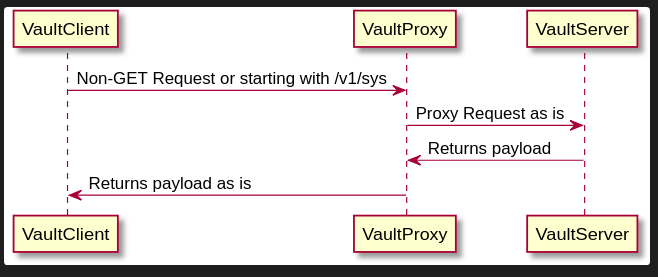

# Vault Symlink Proxy (VLN)

## Logic

Flow for reading secrets


Flow for all the other requests



## Vault Backend

Example policy for KV v2:
```hcl
path "secret/data/vln/symlinksDB" {
  capabilities = ["read"]
}

path "auth/approle/login" {
  capabilities = ["create"]
}
```

Example policy for KV v1:
```hcl
path "secret/vln/symlinksDB" {
  capabilities = ["read"]
}

path "auth/approle/login" {
  capabilities = ["create"]
}
```